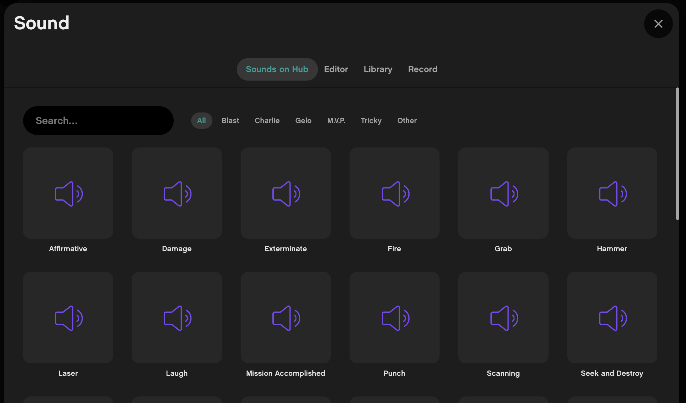

# Currently known advanced functions 
> NOTE: All of these require your program to be uploaded as "Python (advanced)"!

## Playing a sound
Start playing a sound without waiting it to complete (code after this line will execute while the sound is playing)
```python
vm.system.sound.play("/extra_files/<name>")
```

Wait for a sound to complete playing before continuing with code execution:
```python
await vm.system.sound.play_async("/extra_files/<name>")
```

In order to find the `<name>` of the file you can check the sound gallery of the MINDSTORMS/SPIKE Prime app when editing a scratch program:


## Using Animations
You can easily start an animation by using the following function:
```python
vm.system.display.show(frames,
                        clear=False,
                        delay=round(1000 / 8),
                        loop=True,
                        fade=1)

```
Delay is how much time to wait before switching from one image to the other. In the call above the animation will be in 8fps. 

>Hint: If you do not loop you can show a single image instead :)

The `frames` should be an array of `hub.Image`. You can create a `hub.Image` by using its constructor which accepts a string that is 5 groups of 5 digits separate with a colon (`:`) that corresponds to the 5 x 5 matrix on the hub. Each digit represents how bright each of the 25 pixels on the hub will be with `0` being completely off and `9` being at full brightness. For example the code below generates the frames for Charlie's Blinking animation:
```python
import hub

blinking_animation = [
    "77077:00000:99099:99099:00000",
    "77077:00000:99099:99099:00000",
    "77077:00000:99099:99099:00000",
    "77077:00000:99099:99099:00000",
    "77077:00000:00000:77077:00000",
    "77077:00000:00000:00000:00000",
    "77077:00000:00000:88088:00000",
    "77077:00000:99099:99099:00000",
    "77077:00000:99099:99099:00000",
    "77077:00000:99099:99099:00000",
    "77077:00000:99099:99099:00000",
    "77077:00000:99099:99099:00000",
    "77077:00000:99099:99099:00000",
    "77077:00000:99099:99099:00000",
    "77077:00000:99099:99099:00000",
]
blinking_frames = [hub.Image(frame) for frame in blinking_animation]

```

## Rotating the hub display

This is useful when showing images and animations
```python
from util.rotation import rotate_hub_display_to_value

rotate_hub_display_to_value("3")
```
The parameter has the following meaning:
* `"1"` - Upright (power button on bottom)
* `"2"` - Left (power button on the right)
* `"3"` - Right (power button on the left)
* `"4"` - Upside Down (power button at the top)

## Handling button states
You can attach an async handler for each of the 3 buttons and handle if they were pressed or released. Note: since the pressing the center button actually cancels the running program you should put only cleanup code in that handler. 
```python
def setup(rpc, system, stop):
    vm = VirtualMachine(rpc, system, stop, "<program_name>")
    #...
    vm.register_on_button("<unique_name>", handler, "left", "pressed")
    #...
    return vm
```
The third arg is the button and you can use `"left"`, `"right"` or `"center"`. The fourth arg should be either `"pressed"` or `"released"`

## Events
In order to handle events you need to subscribe to listen to some event name. This is done in the `setup` function like this:
```python
def setup(rpc, system, stop):
    vm = VirtualMachine(rpc, system, stop, "<program_name>")
    #...
    vm.register_on_broadcast("<unique_subscription_name>", handler, "<broadcast_name>")
    #...
    return vm
```

Your `handler` should look something like this:
```python
async def handler(vm, stack):
    print("I'm handling the broadcast")
```

Then in order to broadcast a given event you can do the following thing:
```python
stacks = vm.broadcast("<broadcast_name>")
```
Note that the code in the handler is executed asynchroniously. In case you want to wait for the execution to complete before continuing with your code after the broadcast you can add the following loop:
```python
while any(stack.is_active() for stack in stacks):
    yield
```